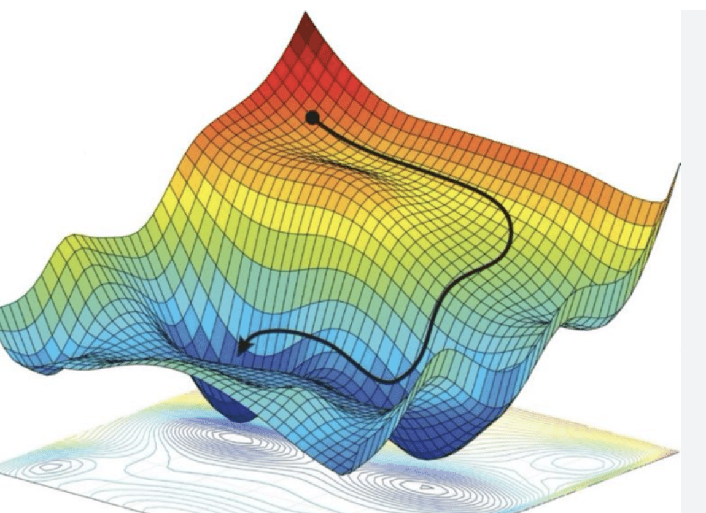

# manviny.iabd

|  | Texto descriptivo que va al lado de la imagen. Puedes agregar más texto aquí si es necesario. |
|:---:|:---|
## Convergencia más rápida
La normalización puede ayudar a que el algoritmo de optimización (como el descenso de gradiente) converja más rápido hacia los valores óptimos de los coeficientes. Cuando las características tienen diferentes escalas, el proceso de convergencia puede ser más lento y menos estable.
